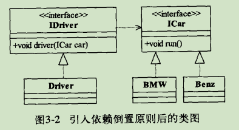

## 依赖倒置原则 
## Dependence Inversion Principle , DIP
High level modules should not depend upon low level modules.Both should depend upon abstractions. Abstractions should not depend upon details.Details should depend upon abstractions.  
 
 1. 高层模块不应该依赖低层模块，两者都应该依赖其抽象； 
 
 2. 抽象不应该依赖细节；  
 
 3. 细节应该依赖抽象。 
 
 面向接口编程  是 OOD Object-Oriented Design 面向对象设计的精髓  
 
    
  
```
  public interface ICar {
  
  	//是汽车就应该能跑
  	public void run();
  }

  public interface IDriver {

	//车辆型号
	public void setCar(ICar car);
	
	//是司机就应该会驾驶汽车
	public void drive();
  }  

  public class BMW  implements ICar{
	
	//宝马车当然也可以开动了
	public void run(){
		System.out.println("宝马汽车开始运行...");
        }
   }

  public class Benz implements ICar{

	//汽车肯定会跑
	public void run(){
		System.out.println("奔驰汽车开始运行...");
        }
  }


  public class Driver implements IDriver{
	private ICar car;
	
	@Override
	public void setCar(ICar car){
		this.car = car;
	}
	
	//司机的主要职责就是驾驶汽车
	@Override
	public void drive(){
		this.car.run();
	}
  }
 ```  
 
 依赖倒置原则的本质就是通过抽象（接口或抽象类）使各个类或模块的实现彼此独立，互不影响，实现模块间的松耦合。
 
 1. 每个类尽量都有接口或抽象类，或者抽象类和接口两者都有；
 
 2. 变量的表面类型尽量是接口或者是抽象类；  
 
 3. 任何类都不应该从具体类派生；
 
 4. 尽量不要覆写基类的方法；
 
 5. 结合里氏替换原则使用。
 
 后面会讲到桥梁模式，可以更加深入的理解依赖倒置原则。平时的开发中service层都会去实现接口去开发，比如设计一个存储功能，先抽象出接口storgeInterface
 ，定义存文件、取文件接口，然后再根据使用场景实现它，比如localStorge、OssStorge等。就是为的是程序更健壮。
      
 
 
